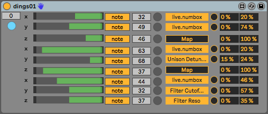
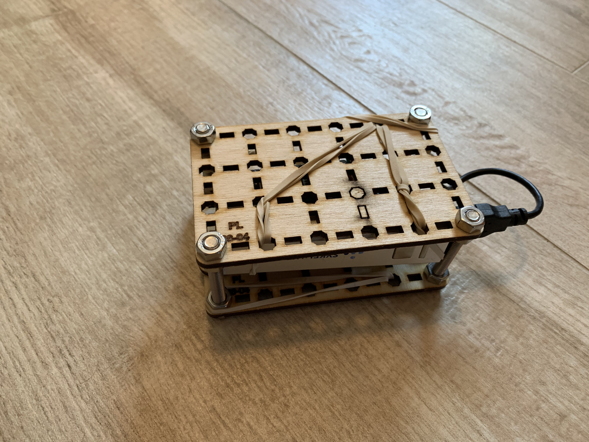
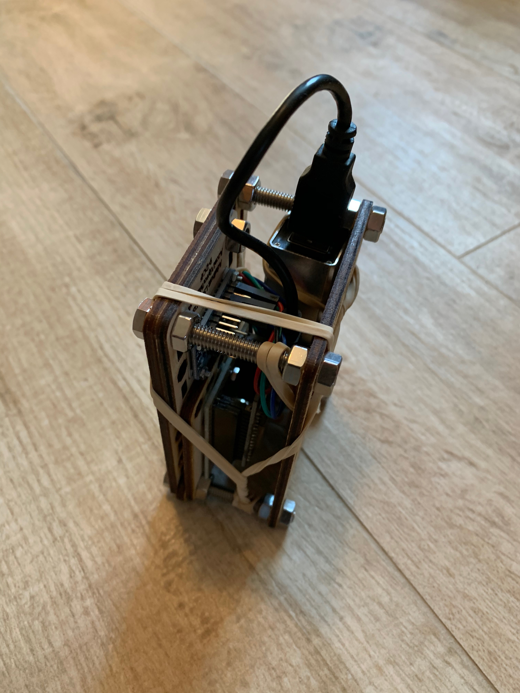
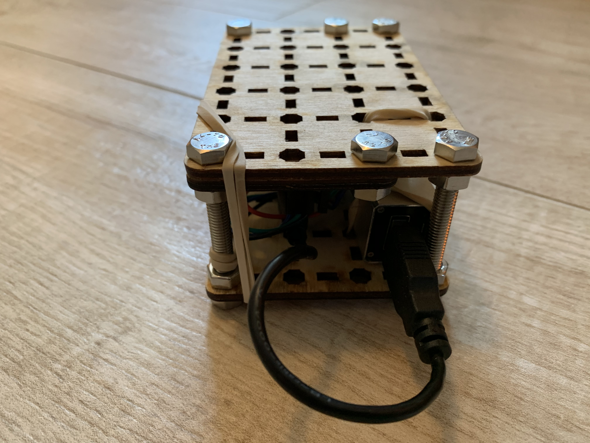

# dings01

Project status: **Under development**

Dings01 is a tangible thing and accompanying software I created to explore human-machine interaction to control musical instruments.

Dings01 detects movements you do with it and translates them into control signals that can control digital musical instruments and effects. A gyroscope measures the change in and angles of the thing. These values ​​get translated into parameters of a synth or effect. Dings01 can be used to create sound landscapes and generate melodies.

Dings01 physically consists of:
- a microcontroller
- a gyroscope
- a battery
- a few wires
- a shell

In overview, it works like this:
- A microcontroller (ESP32) reads the values ​​on the gyroscope
- the microcontroller connects to the internet via Wi-Fi
- [OSC](https://en.wikipedia.org/wiki/Open_Sound_Control) is used to communicate between computer and dings01
- a max for live device communicates between Ableton Live and the thing

You can choose which measurement values ​​from the gyroscope should translate to which parameters on Ableton Live

Dings01 may send both notes and control signals. You can choose a threshold of readings to generate MIDI notes.

Wireless network settings are stored in the memory of the microcontroller. A dedicated application has been created to set wireless network settings. If the microcontroller can not connect to the Wi-Fi network, it automatically enters configuration mode so that you can set the correct settings.

One of the purposes of dings01 was to experiment with latency from motion to change in sound in Ableton Live, and also to explore which settings it might be interesting to control with a gyroscope.

## Hardware

* Microcontroller: [Geekcreit ESP32 microcontroller](https://www.banggood.com/no/ESP32-Development-Board-WiFibluetooth-Ultra-Low-Power-Consumption-Dual-Cores-ESP-32-ESP-32S-Board-p-1109512.html)
* Gyroscope: [Adafruit LSM9DS1](https://learn.adafruit.com/adafruit-lsm9ds1-accelerometer-plus-gyro-plus-magnetometer-9-dof-breakout)
* Battery: Any plain USB battery pack will do

## Firmware

Firmware for the ESP32 is implemented in C++ using the Arduino platform.

[platformio](https://platformio.org/) was used as development platform.

For sourcecode, see: [main.cpp](../firmware/src/main.cpp)

## Setup

see [setup procedure](../../setup/README.md)

## Max 4 Live device

The device can be downloaded here: [dings01.amxd](../m4l/dings01/dings01.amxd)

## Photos of prototype

