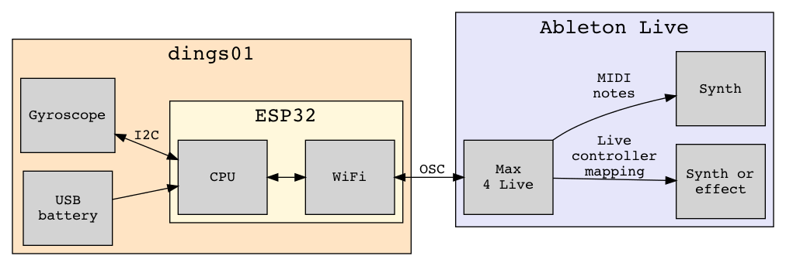

# dings01

## Components

## Firmware

Firmware for the ESP32 is implemented in C++ using the Arduino platform.

[platformio](https://platformio.org/) was used as development platform.

For sourcecode, see: [main.cpp](../firmware/src/main.cpp)

## Max 4 Live device

The device can be downloaded here: [dings01.amxd](../m4l/dings01/dings01.amxd)

## Prototype photos

