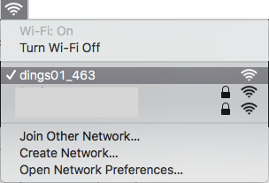
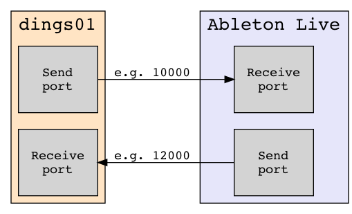

# How to set up dings

At startup, the dings will try to connect to a WiFi.

WiFi settings are stored on the dings, so if settings are incorrect or missing, the dings will try to set up an access point so that you can change settings.

This means that a new, temporary network will be set up with a name simiarl to dings01_987. The three numbers at the end will be different each time.

### Step 1: Search for dings

First, start the setup program and click on **search**.

### Step 2: Connect to temporary wireless network

Connect to the dings access point by looking for the temporary network.

If the dings is found, the setup program should report: "Found device"

It may take som time and a few extra tries to find the network. If you cannot connect to dings, try this:
* turn **off** wifi on your computer
* turn **on** wifi on your computer
* wait one minute
* check if the dings network is found and connect if avaible 
* if you get an error connecting, try again a few times

### Step 3: Enter and save settings

| Field | What to enter |
| ---- | --- |
| **Device name** | The name you want for your device. Can be any name without spaces or special characters |
| **WiFi SSID** | Name of your wireless network. You can use your computer to get this name. Note that you need to use the same name that your computer with Ableton Live is connected to. |
| **WiFi Password** | Password to your network |
| **Send port** | The network port you want to use for communication from the dings. You can use any number over 1024. If unsure, use 10000 |
| **Receive port** | The network port you want to use for communication to the dings. You can use any number over 1024. If unsure, use 10000 |

Click **search** one more, and verify that the program reports "Found device".

Check that all your settings are correct, the click **Send**. The program should report "Config set OK".

Then click **Restart**.

 

